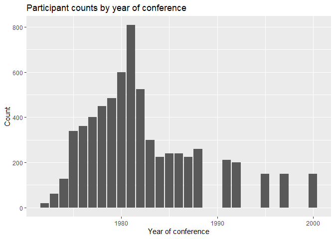

README for icus.data
================
Alan Engel
January 15, 2024

# icus.data

## Introduction

Between 1972 and 2000, Sun Myung Moon’s organizations sponsored 22
conferences on the unity of science. The aim was to bring science under
the moral guidance of Moon’s organizations and their theology. The
programs list 2045 participants, including prominent university
presidents and Nobel Laureates. This project aims to research these
conferences from multiple viewpoints.

This dataset provides several components for researchers who wish to
take a deeper look into these conferences.

## Datasets

1.  **participants** Table of 2045 people who have been listed in ICUS
    programs as speakers, moderators, discussants, advisors and other
    committee members

2.  **programs** Basic data for ICUS conferences from program brochures
    and the ICUS website ([*International Conference on the Unity of the
    Sciences - History* 2020](#ref-icushistory))

3.  **role_defs** Definitions of roles codes in **participants**

4.  **whoswho** Table of participants who are listed in Marquis
    International Who’s Who Editions 40, 50 and 60, which covers the
    first, middle and final thirds of the ICUS conferences that ran from
    1992 to 2000.

5.  **nobels** Table of Nobel Laureates who participated in ICUS
    conferences.

6.  **bibset** Biblatex entries for 1658 speeches and presentations in
    ICUS.

## Special vignettes

1.  **icus program observations** Observations from ICUS program
    brochures including, for example, attendence by Sun Myung Moon and
    his wife Han Hakja, mention of funding by the Unification Church,
    detailed coding of program sessions for use in Set entries in
    \_bibset\_\_.

2.  **build-package** A vignette detailing the workflow for building
    this R data package. I am a memory-challenged novice and this is the
    result of a lot of trial and error.

## Installation

You can install the latest version of **icus.data** from
[github](https://github.com/kijinosu/icus.data) with:

``` r
library(devtools)
devtools::install_github("kijinosu/icus.data")
```

## Examples

### Plot participant counts by year

Load libraries.

``` r
library(icus.data)
library(tidyverse)
```

Plot.

``` r
ggplot(data = progs) +
  geom_bar(mapping = aes(x = Year, y = Count), stat = "identity") +
  labs(title = "Participant counts by year of conference",
       x = "Year of conference")
```

<!-- -->

### Most frequent participants

``` r
activeparts <- tp %>%
  count(ID, Surname, Given, Conference, name = "Roles") %>%
  count(ID, Surname, Given, name = "Conferences") %>%
  arrange(desc(Conferences)) %>%
  select(Given, Surname, Conferences) %>%
  mutate(FullName = paste(.$Given, .$Surname, sep = " ")) %>%
  select(FullName, Conferences)

knitr::kable(activeparts[1:20, ], caption = "Most frequent participants")
```

| FullName                 | Conferences |
|:-------------------------|------------:|
| Gerard Radnitzky         |          18 |
| Nicholas Kurti           |          17 |
| Richard L. Rubenstein    |          17 |
| Marcelo Alonso           |          16 |
| Kenneth Mellanby         |          16 |
| Alexander King           |          15 |
| Guido Pincheira          |          15 |
| Tor Ragnar Gerholm       |          14 |
| Alvin M. Weinberg        |          14 |
| Antony Flew              |          13 |
| Claude A. Villee, Jr.    |          13 |
| Se Won Yoon              |          13 |
| Eugene P. Wigner         |          12 |
| Herman Ole Andreaas Wold |          12 |
| Max Jammer               |          11 |
| Ervin Laszlo             |          11 |
| Frederick Sontag         |          11 |
| Eileen V. Barker         |          10 |
| René Berger              |          10 |
| John Carew Eccles        |          10 |

Most frequent participants

## R packages used for this data package

- DataPackageR - Set up and put the pieces together ([Finak et al.
  2018](#ref-R-DataPackageR))
- RefManageR - Load and process raw BibLatex files ([McLean
  2017](#ref-RefManageR2017)) and ([McLean 2014](#ref-RefManageR2014))
- ([Wickham 2023](#ref-R-tidyverse))
- ([Dowle and Srinivasan 2023](#ref-R-data.table))

## References

<div id="refs" class="references csl-bib-body hanging-indent">

<div id="ref-R-data.table" class="csl-entry">

Dowle, Matt, and Arun Srinivasan. 2023. *Data.table: Extension of
‘Data.frame‘*. <https://CRAN.R-project.org/package=data.table>.

</div>

<div id="ref-R-DataPackageR" class="csl-entry">

Finak, G, B Mayer, W Fulp, P Obrecht, A Sato, E Chung, D Holman, and R
Gottardo. 2018. “DataPackageR: Reproducible Data Preprocessing,
Standardization and Sharing Using r/Bioconductor for Collaborative Data
Analysis \[Version 2; Referees: 2 Approved, 1 Approved with
Reservations\].” *Gates Open Research* 2 (31).
<https://doi.org/10.12688/gatesopenres.12832.2>.

</div>

<div id="ref-icushistory" class="csl-entry">

*International Conference on the Unity of the Sciences - History*. 2020.
ICUS. <https://icus.org/about-2/history/>.

</div>

<div id="ref-RefManageR2014" class="csl-entry">

McLean, Mathew William. 2014. *Straightforward Bibliography Management
in r Using the RefManager Package*. <https://arxiv.org/abs/1403.2036>.

</div>

<div id="ref-RefManageR2017" class="csl-entry">

———. 2017. “RefManageR: Import and Manage BibTeX and BibLaTeX References
in r.” *The Journal of Open Source Software*.
<https://doi.org/10.21105/joss.00338>.

</div>

<div id="ref-R-tidyverse" class="csl-entry">

Wickham, Hadley. 2023. *Tidyverse: Easily Install and Load the
Tidyverse*. <https://CRAN.R-project.org/package=tidyverse>.

</div>

</div>
